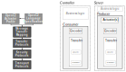

# openc2lib: extensible OpenC2 Library

## Description

openc2lib is an open-source implementation of the OpenC2 language written in Python. It is explicitly designed with flexibility and extensibility in mind, meaning that additional profiles and actuators can be added without impacting the core library itself. For this reason, openc2lib is particullary suited for:
- developers that are looking for a common interface to control their remote cybersecurity functions;
- researchers that design new profiles for cybersecurity functions;
- system integrators that need a common language for their cybersecurity frameworks. 

Usage and extension of openc2lib have a shallow learning curve because data structures are explicitly designed to follow the language specification. Differently from many other implementations publicly available, introducing new transfer protocols, new message encoding formats, new profiles, and new implementations of actuators does not require modification to the core package; these extensions are easily to introduce because they largely reflect the language specification, hence minimal comprehension of the openc2lib is required to getting started.

The openc2lib currently provides:
- the implementation of the core functions that implement the OpenC2 Architecture and Language Specification;
- an implementation of the json encoder;
- an implementation of the HTTP transfer protocol;
- the definition of the SLPF profile;
- a dumb implementation of an actuator for the SLPF profile.

## Getting started

### Background

Before using openc2lib you must be familiar with the [OpenC2 Language Specification](https://docs.oasis-open.org/openc2/oc2ls/v1.0/cs02/oc2ls-v1.0-cs02.pdf). Even if not strictly required to getting started with the code, the [OpenC2 Architecture Specification]([https://docs.oasis-open.org/openc2/oc2arch/v1.0/cs01/oc2arch-v1.0-cs01.pdf](https://docs.oasis-open.org/openc2/oc2ls/v1.0/cs02/oc2ls-v1.0-cs02.pdf)) provides a good introduction to OpenC2 architectural patterns and terminology.
Other relevant documentation is listed in the [Related documents](docs/relateddocuments.md) Section.

### Architecture 

The openc2lib provides the implementation of the _Producer_ and _Consumer_ roles, as defined by the [Language Specification](https://docs.oasis-open.org/openc2/oc2ls/v1.0/cs02/oc2ls-v1.0-cs02.pdf). The _Producer_ creates and sends _Messages_ to the _Consumer_; the latter returns _Responses_. Within the _Consumer_, _Actuators_ translate the _Commands_ into the specific instructions to control local or remote _Security Functions_, and collect any feedback on their execution. 


The _Producer_ and the _Consumer_ usually run on different hosts separated by a network. While the _Producer_ is expected to be used as Python library within existing code (for example, a controller), the _Consumer_ is a server process that listens on a given port waiting for _Commands_. 

openc2lib provides the `Provider` and `Consumer` classes that implements the _Provider_ and _Consumer_ role, respectively. Each class creates its own execution environment made of its own identifier, a protocol stack, and the available _Actuators_ (this last only for the `Consumer`). According to the [OpenC2 Architecture](https://docs.oasis-open.org/openc2/oc2arch/v1.0/cs01/oc2arch-v1.0-cs01.pdf](https://docs.oasis-open.org/openc2/oc2ls/v1.0/cs02/oc2ls-v1.0-cs02.pdf), a protocol stack includes an encoding language and a transfer protocol. Note that in the openc2lib implementation, the security services and transport protocols are already embedded in each specific transfer protocol.



Building on the definitions in the OpenC2 Architecture and Language Specification, the openc2lib defines a _profile_ as the language extension for a specific class of security functions, whereas an _actuator_ is the concrete implementation for a specific security appliance. For instance, the [OpenC2 Profile for Stateless Packet Filtering](https://docs.oasis-open.org/openc2/oc2slpf/v1.0/cs01/oc2slpf-v1.0-cs01.pdf) is a _profile_ that defines all grammar and syntax rules for adding and removing rules from a packet firewall. The corresponding _actuators_ must translate this abstract interface to concrete commands (e.g., for iptables, pfsense). A more detailed discussion is present in the [Developing extensions](docs/developingextensions.md) Section.

### Software requirements

Python 3.9+ is required to run the openc2lib (Python 3.11 was used for development).

### Download and setup

The openc2lib is currently available as source code only. Dowload it from github:
```
git clone https://github.com/mattereppe/openc2.git
```
(this creates an `openc2` folder).

The repository includes a venv that contains all required Python 3.11 packages. Enter the `openc2` folder and activate the environment:
```
. .venv/bin/activate
```
To use the library you must include the `<installdir>/src/` the Python path according to the download directory. You can either:
- add the library path in your code (this must be done for every module):
  ```
  import sys
  sys.path.append('<_your_path_here_>')
  ```
- add the library path to the PYTHONPATH environmental variable (this is not persistent when you close the shell):
  ```
  export PYTHONPATH=$PYTHONPATH':<_your_path_here_>'
  ```
- add the library path to the venv (this is my preferred option):
  ```
  echo '<_your_path_here_>/src' > .venv/lib/python3.11/site-packages/openc2lib.pth
  ```

A few scripts are available in the `test` folder for sending a simple commmand to a remote actuator (see [Usage](#usage)).

## Usage 

Basic usage description covers the step to instantiate the `Producer` and the `Consumer`, and send messages. This requires the availability of a minimal set of encoders, transfer protocols, profiles, and actuator implementations. See the [Developing extensions](docs/developingextensions.md) Section to learn how to add your custom extensions. In the following we refer to the implementation of a `Controller` that sends _Commands_ and a `Server` that controls local security functions. Simple implementation of these functions are provided in the `test` folder.

### Create a Server

A `Server` is intended to instantiate and run the OpenC2 `Consumer`. Instantiation requires the definition of the protocol stack and the configuration of the `Actuator`s that will be exposed.

As a preliminary step, the necessary modules must be imported. Note that the openc2lib only includes core grammar and syntax elements, and all the necessary extensions (including encoders, trasfer protocols, profiles, and actuators) must be imported separetely. We will use json encoding and HTTP for our protocol stack, and an iptables actuator for stateless packet filtering:
```
import openc2lib as oc2

from openc2lib.encoders.json_encoder import JSONEncoder
from openc2lib.transfers.http_transfer import HTTPTransfer

import openc2lib.profiles.slpf as slpf
from openc2lib.actuators.iptables_actuator import IptablesActuator
```

First, we instantiate the `IptablesActuator` as an implementation of the `slpf` profile:
```
 actuators = {}
 actuators[(slpf.nsid,'iptables')]=IptablesActuator()
```
(there is no specific configuration here because the `IptablesActuator` is currently a mockup)

Next, we create the `Consumer` by instantiating its execution environment with the list of served `Actuator`s and the protocol stack. We also provide an identification string:
```
consumer = oc2.Consumer("consumer.example.net", actuators, JSONEncoder(), HTTPTransfer("127.0.0.1", 8080))
```
(the server will be listening on the loopback interface, port 8080)

Finally, start the server:
```
 consumer.run()
```

The server code can indeed be improved by loading the configuration from file and setting up [Logging for openc2lib](docs/logging.md). 

### Create the Controller

A `Controller` is intended to instantiate an OpenC2 `Producer` and to use it to control a remote security function. Instantiation requires the definition of the same protocol stack we used for the server, and an identifier:
```
producer = oc2.Producer("producer.example.net", JSONEncoder(), HTTPTransfer("127.0.0.1", 8080))
```
(the same modules must be imported as for the `Server` but the `iptables_actuator`)

Next we create the `Command`, by combining the _Action_, _Target_, _Arguments_, and _Actuator_. We will query the remote `slpf` actuator for its capabilities. Note how we mix common language elements with specific extensions for the `slpf` profile, as expected by the Specification:
```
pf = slpf.slpf({'hostname':'firewall', 'named_group':'firewalls', 'asset_id':'iptables'})
arg = slpf.ExtArgs({'response_requested': oc2.ResponseType.complete})
 
cmd = oc2.Command(oc2.Actions.query, oc2.Features(), actuator=pf)
```

Finally, we send the command and catch the response:
```
resp = p.sendcmd(cmd)
```
(print out `resp` to check what the server returned)

A concrete implementation of a _Controller_ would also include the business logic to update rules on specific events (even by specific input from the user).


## Advanced usage


# Editing this README

When you're ready to make this README your own, just edit this file and use the handy template below (or feel free to structure it however you want - this is just a starting point!). Thanks to [makeareadme.com](https://www.makeareadme.com/) for this template.

## Suggestions for a good README

Every project is different, so consider which of these sections apply to yours. The sections used in the template are suggestions for most open source projects. Also keep in mind that while a README can be too long and detailed, too long is better than too short. If you think your README is too long, consider utilizing another form of documentation rather than cutting out information.

## Name
Choose a self-explaining name for your project.

## Description
Let people know what your project can do specifically. Provide context and add a link to any reference visitors might be unfamiliar with. A list of Features or a Background subsection can also be added here. If there are alternatives to your project, this is a good place to list differentiating factors.

## Badges
On some READMEs, you may see small images that convey metadata, such as whether or not all the tests are passing for the project. You can use Shields to add some to your README. Many services also have instructions for adding a badge.

## Visuals
Depending on what you are making, it can be a good idea to include screenshots or even a video (you'll frequently see GIFs rather than actual videos). Tools like ttygif can help, but check out Asciinema for a more sophisticated method.

## Installation
Within a particular ecosystem, there may be a common way of installing things, such as using Yarn, NuGet, or Homebrew. However, consider the possibility that whoever is reading your README is a novice and would like more guidance. Listing specific steps helps remove ambiguity and gets people to using your project as quickly as possible. If it only runs in a specific context like a particular programming language version or operating system or has dependencies that have to be installed manually, also add a Requirements subsection.

## Usage
Use examples liberally, and show the expected output if you can. It's helpful to have inline the smallest example of usage that you can demonstrate, while providing links to more sophisticated examples if they are too long to reasonably include in the README.

## Support
Tell people where they can go to for help. It can be any combination of an issue tracker, a chat room, an email address, etc.

## Roadmap
If you have ideas for releases in the future, it is a good idea to list them in the README.

## Contributing
State if you are open to contributions and what your requirements are for accepting them.

For people who want to make changes to your project, it's helpful to have some documentation on how to get started. Perhaps there is a script that they should run or some environment variables that they need to set. Make these steps explicit. These instructions could also be useful to your future self.

You can also document commands to lint the code or run tests. These steps help to ensure high code quality and reduce the likelihood that the changes inadvertently break something. Having instructions for running tests is especially helpful if it requires external setup, such as starting a Selenium server for testing in a browser.

## Authors and acknowledgment
Show your appreciation to those who have contributed to the project.

## License
For open source projects, say how it is licensed.

## Project status
If you have run out of energy or time for your project, put a note at the top of the README saying that development has slowed down or stopped completely. Someone may choose to fork your project or volunteer to step in as a maintainer or owner, allowing your project to keep going. You can also make an explicit request for maintainers.
